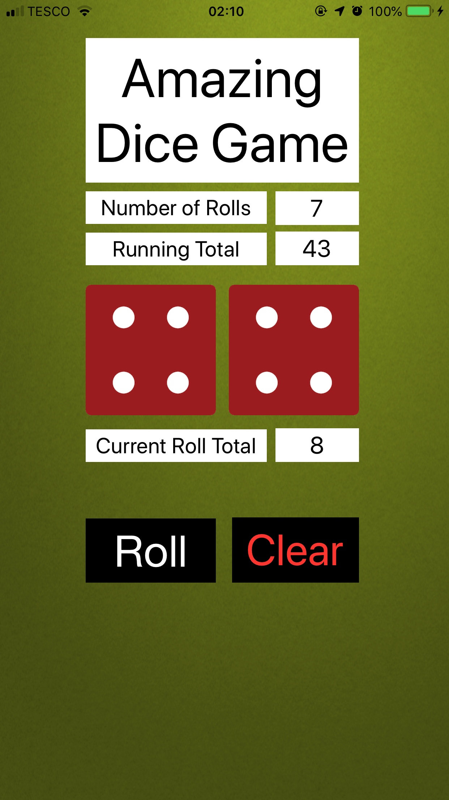
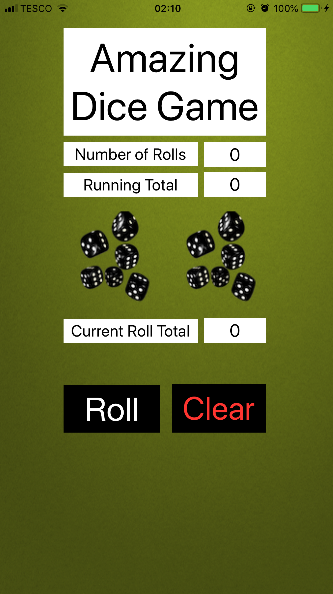

# Dice App

[](https://www.swift.org/)
[](https://developer.apple.com/documentation/uikit)
[](https://github.com/AlakhiarovSalekh/Dice-App/stargazers)

A simple iOS dice roller built with Swift. Roll two dice using the button or by shaking the device, then see the combined total.

<p align="center">
  
  
</p>

## Features

- Two six-sided dice
- Random roll generation
- Combined total after every roll
- Roll button interaction
- Shake-to-roll interaction
- Automatic roll when the view loads

## How It Works

`updateDiceImages()` generates two random indexes from 0 to 5, uses them to select dice images, and displays the combined value. The same update is triggered from the roll button and device motion handling.

```swift
func updateDiceImages() {
    randomDiceIndex1 = Int.random(in: 0 ... 5)
    randomDiceIndex2 = Int.random(in: 0 ... 5)
    total = (randomDiceIndex1 + randomDiceIndex2) + 2

    diceImageView1.image = UIImage(named: diceArray[randomDiceIndex1])
    diceImageView2.image = UIImage(named: diceArray[randomDiceIndex2])
    totalAmountView.text = String(total)
}
```

## Getting Started

```bash
git clone https://github.com/AlakhiarovSalekh/Dice-App.git
```

Open `Dicee.xcodeproj` in Xcode and run the app in an iOS simulator or on a compatible device.

## Contributing

Small bug fixes, documentation improvements, accessibility changes, and UI refinements are welcome.

## Author

**Salekh Alakhiarov** · [GitHub](https://github.com/AlakhiarovSalekh)
